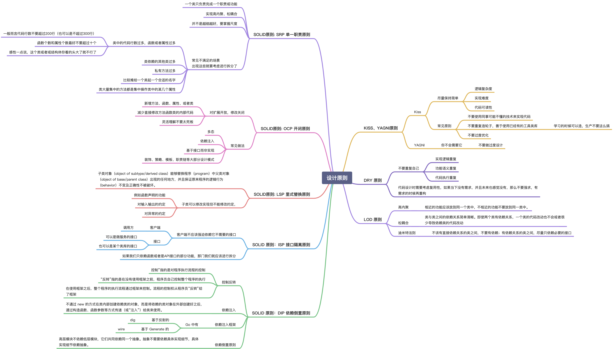
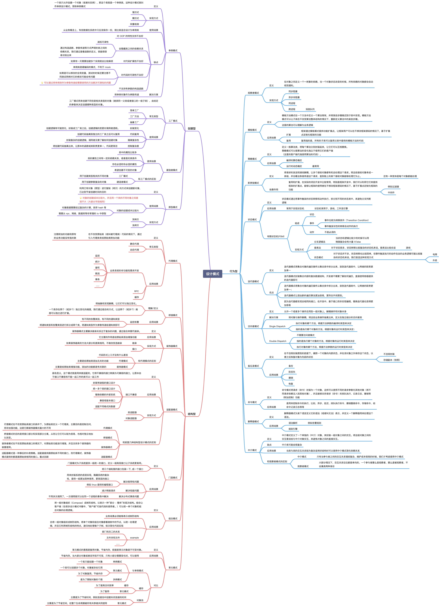

# go-design-pattern

更多系列文章可以扫描下方二维码关注博主

## 总结

原本预计是在十月底更新完毕这个系列，到今天是11-05，晚了几天，不过也还好，这是第一次这么密集的去更新博客上的内容，更多的是以笔记的形式来呈现，加上这篇一共24篇文章差不多两个半月的时间，平均每周输出两篇，感觉还是不错。后续可能会视情况不定期的更新一些实战内容，也有可能没有。接下来下一个系列应该是数据结构与算法，包含对 Go 中一些底层数据和标准库包的学习，例如 slice, sort 等等。

话说回来，回头再看学习设计模式我们究竟需要学习一些什么？

-   写 Go 需要使用到设计模式么？
    -   需要，但是切记请勿使用其他语言的方式来写 Go
    -   如果看过之前的一些文章，就会发现类似 JAVA 的这些面向对象语言中的某些设计模式的写法在 Go 中会十分的别扭
    -   但是 Go 不需要设计模式么？不是的，设计模式的思想是想通的，并且我们一直都在使用，例如我们常见的对象创建方式 `NewXXX` 这其实就是一个简单工厂
-   设计模式学习的重点是什么？
    -   设计原则，以及设计模式的使用场景和优缺点，实现相对来说还没有那么重要
    -   如果是常见的设计模式是武术招式，那么设计原则就是内功心法，没有内功心法那么招式套路也就是花架子
    -   熟练掌握不同设计模式的使用场景可以帮助我们学会见招拆招，灵活应用而不是只会套路
-   **最后设计模式不是银弹，不要拿着🔨就觉得哪里都像是钉子，不要过早优化，持续重构才是正道**

### 设计原则

> 同时这也是 Code Review 的重要标准之一

 
点击展开设计原则

 

### 设计模式

 
点击展开设计模式

 

## Go设计模式

-   单例模式包含饿汉式和懒汉式两种实现
-   工厂模式包含简单工厂、工厂方法、抽象工厂、DI容器
-   代理模式包含静态代理、动态代理（采用 go generate 模拟）
-   观察者模式包含观察者模式、eventbus

|  **类型**  |                                                  **设计模式（Github）**                                                   | **常用** |                                       **博客**                                        |
| :--------: | :-----------------------------------------------------------------------------------------------------------------------: | :------: | :-----------------------------------------------------------------------------------: |
| **创建型** |       [单例模式(Singleton Design Pattern)](https://github.com/mohuishou/go-design-pattern/blob/master/01_singleton)       |    ✅     |            [Go设计模式01-单例模式](https://lailin.xyz/post/singleton.html)            |
|            |         [工厂模式(Factory Design Pattern)](https://github.com/mohuishou/go-design-pattern/blob/master/02_factory)         |    ✅     |         [Go设计模式02-工厂模式&DI容器](https://lailin.xyz/post/factory.html)          |
|            |        [建造者模式(Builder Design Pattern)](https://github.com/mohuishou/go-design-pattern/blob/master/03_builder)        |    ✅     |            [Go设计模式03-建造者模式](https://lailin.xyz/post/builder.html)            |
|            |       [原型模式(Prototype Design Pattern)](https://github.com/mohuishou/go-design-pattern/blob/master/04_prototype)       |    ❌     |            [Go设计模式04-原型模式](https://lailin.xyz/post/prototype.html)            |
| **结构型** |           [代理模式(Proxy Design Pattern)](https://github.com/mohuishou/go-design-pattern/blob/master/05_proxy)           |    ✅     | [Go设计模式06-代理模式(generate实现类似动态代理)](https://lailin.xyz/post/proxy.html) |
|            |          [桥接模式(Bridge Design Pattern)](https://github.com/mohuishou/go-design-pattern/blob/master/06_bridge)          |    ✅     |             [Go设计模式07-桥接模式](https://lailin.xyz/post/bridge.html)              |
|            |      [装饰器模式(Decorator Design Pattern)](https://github.com/mohuishou/go-design-pattern/blob/master/07_decorator)      |    ✅     |           [Go设计模式08-装饰器模式](https://lailin.xyz/post/decorator.html)           |
|            |        [适配器模式(Adapter Design Pattern)](https://github.com/mohuishou/go-design-pattern/blob/master/08_adapter)        |    ✅     |            [Go设计模式09-适配器模式](https://lailin.xyz/post/adapter.html)            |
|            |          [门面模式(Facade Design Pattern)](https://github.com/mohuishou/go-design-pattern/blob/master/09_facade)          |    ❌     |             [Go设计模式10-门面模式](https://lailin.xyz/post/facade.html)              |
|            |       [组合模式(Composite Design Pattern)](https://github.com/mohuishou/go-design-pattern/blob/master/10_composite)       |    ❌     |            [Go设计模式11-组合模式](https://lailin.xyz/post/composite.html)            |
|            |       [享元模式(Flyweight Design Pattern)](https://github.com/mohuishou/go-design-pattern/blob/master/11_flyweight)       |    ❌     |            [Go设计模式12-享元模式](https://lailin.xyz/post/flyweight.html)            |
| **行为型** |       [观察者模式(Observer Design Pattern)](https://github.com/mohuishou/go-design-pattern/blob/master/12_observer)       |    ✅     | [Go设计模式13-观察者模式(实现简单的EventBus)](https://lailin.xyz/post/observer.html)  |
|            |    [模板模式(Template Method Design Pattern)](https://github.com/mohuishou/go-design-pattern/blob/master/13_template)     |    ✅     |            [Go模板模式14-模板模式](https://lailin.xyz/post/template.html)             |
|            |    [策略模式(Strategy Method Design Pattern)](https://github.com/mohuishou/go-design-pattern/blob/master/14_strategy)     |    ✅     |            [Go设计模式15-策略模式](https://lailin.xyz/post/strategy.html)             |
|            | [职责链模式(Chain Of Responsibility Design Pattern)](https://github.com/mohuishou/go-design-pattern/blob/master/15_chain) |    ✅     |    [Go设计模式16-职责链模式(Gin的中间件实现)](https://lailin.xyz/post/chain.html)     |
|            |           [状态模式(State Design Pattern)](https://github.com/mohuishou/go-design-pattern/blob/master/16_state)           |    ✅     |              [Go设计模式17-状态模式](https://lailin.xyz/post/state.html)              |
|            |       [迭代器模式(Iterator Design Pattern)](https://github.com/mohuishou/go-design-pattern/blob/master/17_iterator)       |    ✅     |           [Go设计模式18-迭代器模式](https://lailin.xyz/post/iterator.html)            |
|            |  [访问者模式(Visitor Design Pattern)](https://github.com/mohuishou/go-design-pattern/blob/master/18_visitor/visitor.go)   |    ❌     |            [Go设计模式19-访问者模式](https://lailin.xyz/post/visitor.html)            |
|            |        [备忘录模式(Memento Design Pattern)](https://github.com/mohuishou/go-design-pattern/blob/master/19_memento)        |    ❌     |            [Go设计模式20-备忘录模式](https://lailin.xyz/post/memento.html)            |
|            |         [命令模式(Command Design Pattern)](https://github.com/mohuishou/go-design-pattern/blob/master/20_command)         |    ❌     |             [Go设计模式21-命令模式](https://lailin.xyz/post/command.html)             |
|            |    [解释器模式(Interpreter Design Pattern)](https://github.com/mohuishou/go-design-pattern/blob/master/21_interpreter)    |    ❌     |          [Go设计模式22-解释器模式](https://lailin.xyz/post/interpreter.html)          |
|            |        [中介模式(Mediator Design Pattern)](https://github.com/mohuishou/go-design-pattern/blob/master/22_mediator)        |    ❌     |            [Go设计模式23-中介模式](https://lailin.xyz/post/mediator.html)             |